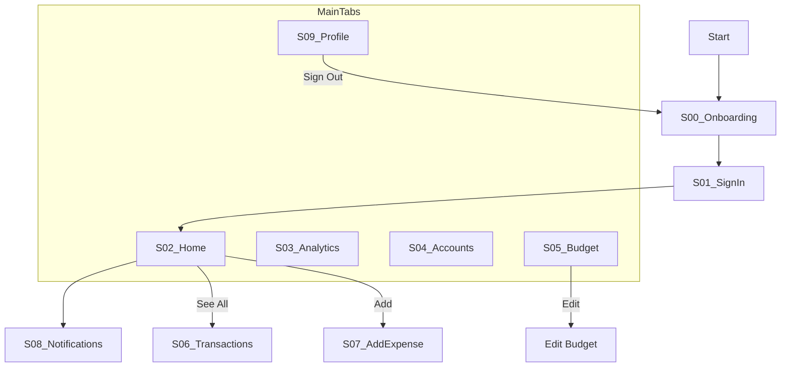

# UI/UX Flow & Screen Inventory: FitLife Finance

## 1. Global Navigation Structure
The application uses a **Hybrid Navigation** pattern:
*   **Top-Level:** Bottom Navigation Bar (Persistent across 5 tabs).
*   **Details:** Stack-based navigation (Push/Pop).
*   **Modals:** BottomSheet presentation for inputs.

## 2. Screen Inventory

### S00: Onboarding / Landing
*   **Elements:** "FinanceManager" Title, Feature Pills (Track, Budget, Save), "Get Started" Button, "Sign In" Link.
*   **Transition:** Fade In. Action leads to S01 or Registration.

### S01: Sign In
*   **Elements:** Back Button, Email Field, Password Field (w/ Eye toggle), "Sign In" Button, "Forgot Password", Social Login (Google/FB).
*   **Transition:** Push from Right.

### S02: Home Dashboard (Tab: Home)
*   **Layout:** 
    *   **Header:** Greeting, Notification Bell (Badge enabled).
    *   **Hero:** Total Balance Card with Trend (+12.5%).
    *   **Grid:** Quick Actions (Send, Request, Add, More).
    *   **List:** Recent Transactions (Header + List Items).
*   **Interactions:** 
    *   Tap "Add" -> Opens S07 (Add Expense).
    *   Tap Bell -> Opens S08 (Notifications).
    *   Tap "See All" -> Opens S06 (Transactions).

### S03: Analytics (Tab: Analytics)
*   **Layout:**
    *   **Tabs:** Week, Month, Quarter, Year segments.
    *   **Chart:** Bar chart (Spending this week).
    *   **Cards:** Total Spent vs Total Income summaries.
    *   **Breakdown:** Donut chart (Spending by Category) + Legend list.

### S04: Bank Accounts (Tab: Cards)
*   **Layout:**
    *   **Header:** Total Balance (All Accounts).
    *   **List:** Cards for Chase Checking, BoA Savings, Wells Fargo Credit (Red alert status), Ally Savings.
    *   **Action:** "+ Link New Account" button.

### S05: Budget Planner (Tab: Budget)
*   **Layout:**
    *   **Nav:** Month Selector (< December 2024 >).
    *   **Summary:** Total Monthly Budget progress.
    *   **List:** Category cards (Housing, Food & Dining, Entertainment, Transportation) with specific colored progress bars.
*   **Edge Case:** "Entertainment" shows Over Budget status text in Red.

### S06: Transactions List
*   **Layout:**
    *   **Top:** Search Bar, Filter Chips (All, Income, Expense, Transfer).
    *   **Body:** Grouped List (Today, Yesterday, Date).
    *   **Card:** Category Icon, Merchant Name, Amount (Color coded).

### S07: Add Expense (Modal)
*   **Type:** Full-screen or High-height Bottom Sheet.
*   **Fields:** Amount (Input), Category (Select), Pay From (Select), Date/Time (Pickers), Notes, Recurring Toggle.
*   **Action:** "Save Expense" floating or fixed bottom button.

### S08: Notifications
*   **Layout:**
    *   **Sections:** New, Earlier.
    *   **Item:** Icon, Title (Salary Received), Body, Timestamp.
    *   **Action:** "Mark all read" in header.

### S09: Profile (Tab: Profile)
*   **Layout:**
    *   **Header:** User Avatar, Name, Email, Status Badge (Premium Plan).
    *   **Settings:** Account Settings > Personal Info, Security, Accounts.
    *   **Preferences:** Dark Mode Toggle, Currency, Language.
    *   **Footer:** Destructive Action "Sign Out".

## 3. Navigation Map (Graph)
