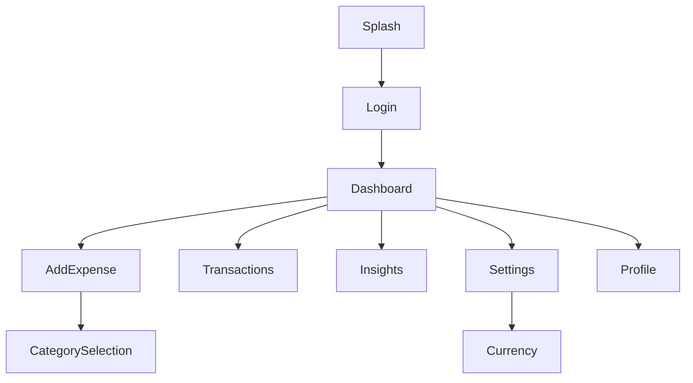

# UI/UX Flow & Screen Inventory
## Application: FitLife Finance

### 1. Global UI Elements & Theming
- **Theme:** `FitLifeTheme` extending Material 3.
- **Primary Color:** FitLife Blue (`#1E88E5`) - Derived from wireframe analysis.
- **Surface Color:** `#FFFFFF` (Cards) and `#F5F5F5` (Background).
- **Typography:** `Roboto` or `Inter`. 
- **Icons:** Material Symbols Outlined.

### 2. Screen Inventory & Layout Descriptions

#### 2.1 Splash Screen
- **Layout:** `Box` with centered content.
- **Elements:** App Logo (Vector), App Title "Finance Manager" (HeadlineLarge), "Get Started" Button (Button, bottom aligned).

#### 2.2 Login Screen
- **Layout:** `Column` with centered vertical alignment.
- **Elements:**
  - Header Text "Login".
  - `OutlinedTextField` for Email.
  - `OutlinedTextField` for Password (with visibility toggle).
  - `TextButton` "Forget password?".
  - `Button` "Log in" (Fill width).

#### 2.3 Dashboard (Main)
- **Layout:** `Scaffold` with `TopAppBar`.
- **Content:** `LazyColumn`.
  - **Item 1:** Balance Card. rounded corners, gradient blue background.
  - **Item 2:** Spending Report. `Vico` Column Chart. X-axis: Days, Y-axis: Amount.
  - **Item 3:** Section Header "Recent Transactions" + "See All" TextButton.
  - **Item 4-8:** Transaction Items (Row: IconBox, Column(Merchant, Category), Spacer, Amount).

#### 2.4 Add Expense / Add Income
- **Layout:** `Column` with `verticalScroll`.
- **Elements:**
  - `TextField` for Amount (Large text, center).
  - `Row` for Date Selection.
  - Catgeory Selector (Clickable Row leading to BottomSheet).
  - `OutlinedTextField` for Notes.
  - Floating or Bottom-Docked "Save" Button.

#### 2.5 Monthly Insights
- **Layout:** `Column`.
- **Elements:**
  - Donut Chart (Center). Segments: Income, Expense.
  - Data Grid: 3 Columns (Income, Expense, Balance) showing Totals.

### 3. Navigation Map

### 4. Accessibility Guidelines
- **Contrast:** Ensure Text colors on the Activity Cards (Blue background) are White (`#FFFFFF`).
- **Scaling:** Support 200% font scaling via `sp` units.
- **TalkBack:** 
  - Bar Chart must use `semantics` traversal group to read: "Spending for Monday is $50".
  - Buttons must have state labels (e.g., "Add Expense, Disabled, Enter amount first").